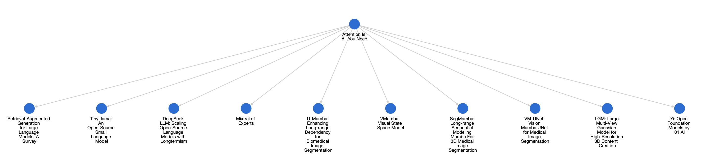
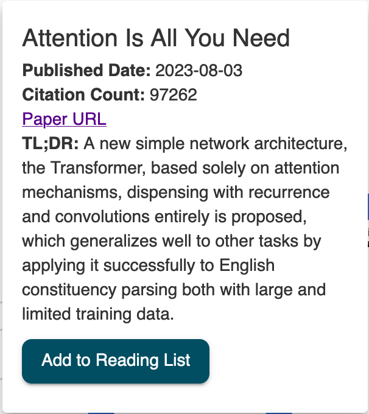
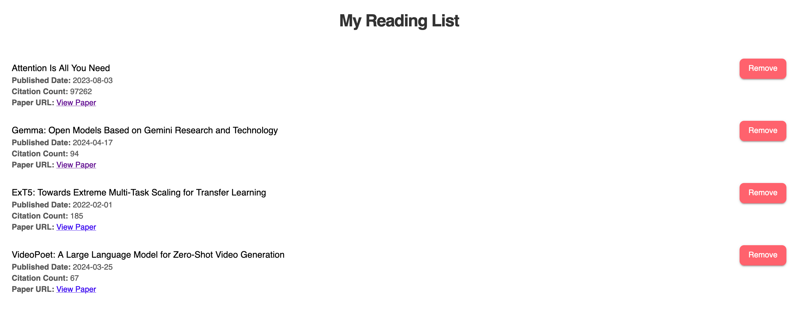
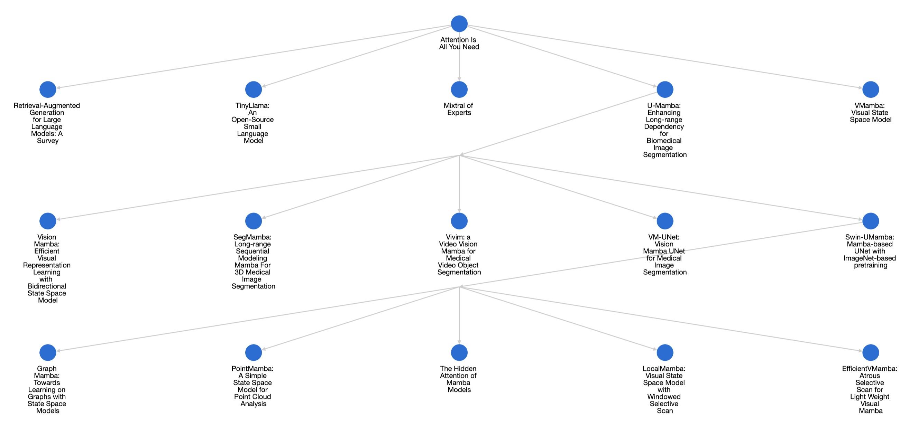

# 🎯 Citation Analysis & Bibliometrics Explorer


> Discover the evolution of AI/ML research through interactive citation networks

This tool helps you visualize and explore the interconnected world of Machine Learning research papers from the past decade, allowing you to:

🔍 **Discover** the most influential ideas in machine learning  
🏗️ **Trace** the stepping stones of current state-of-the-art research  
📈 **Identify** emerging trends in scholarly circles

## ✨ Features

### 1. Interactive Citation Graphs
Explore papers in a BFS (Breadth-First Search) manner to see how ideas evolve over time. Here's the citation graph starting from the landmark "Attention is all you need" paper:

<p align="center">
  
</p>

### 2. Paper Insights at a Glance
Hover over any paper to get quick insights without diving deep:

<p align="center">
  
</p>

### 3. Personalized Reading Lists
Build your research roadmap by saving interesting papers for later:

<p align="center">
  
</p>

### 4. Deep Exploration
Click on any paper to discover its most influential derivatives. Perfect for:
- Tracking idea evolution
- Finding research gaps
- Understanding paper lineage

<p align="center">
  
</p>

## 🚀 Getting Started

### 1. Backend Setup (FastAPI)
   
Run FASTAPI backend app:
```
cd citation-network-backend
mkdir data
python3 -m venv .venv
source .venv/bin/activate
pip install -r requirements.txt 

uvicorn app:app --host 0.0.0.0 --port 8000 --reload
```

> 💡 Download the demo database from [here](s3://gifs-and-vids/citations_data.db) and place it in the `data` folder.
   

### 2. Frontend Setup (React)

#### Prerequisites
Ensure you have Node.js and npm installed:
   
```bash
node --version
npm --version
```

#### Installation Options

**macOS:**
```bash
brew install node
```

**Linux (Ubuntu/Debian):**
```bash
sudo apt update
sudo apt install nodejs npm
```

#### Environment Configuration
1. Create `.env` in `citation-network-ui`
2. Copy from `.env.example` and configure:
```
REACT_APP_FIREBASE_API_KEY=your_api_key_here
REACT_APP_FIREBASE_AUTH_DOMAIN=your_auth_domain_here
REACT_APP_FIREBASE_PROJECT_ID=your_project_id_here
REACT_APP_FIREBASE_STORAGE_BUCKET=your_storage_bucket_here
REACT_APP_FIREBASE_MESSAGING_SENDER_ID=your_sender_id_here
REACT_APP_FIREBASE_APP_ID=your_app_id_here
REACT_APP_FIREBASE_MEASUREMENT_ID=your_measurement_id_here
```

#### Launch Frontend

```bash
cd citation-network-ui
npm install
npm start -- --host 0.0.0.0
```

## 🛠️ Graph Building Pipeline

The `build_graph` directory contains tools to create citation networks through these steps:

1. **Data Collection**: Fetch ML papers from Arxiv (last 10 years)
2. **Citation Analysis**: Gather citation data from Semantic Scholar
3. **Graph Generation**: Create DOT files with papers as nodes and citations as edges
4. **Ranking**: Apply PageRank to identify influential papers
5. **Database Integration**: Process and store graph data for FastAPI backend
